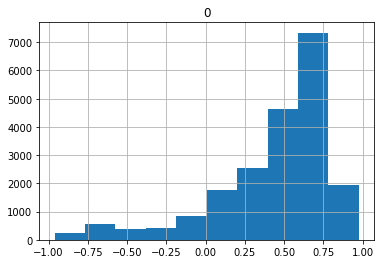

### debug the geohot's model
1. skewed output distribution, always choose the move faver to WHITE:

This model is too bad to impove, I decide to make a new one.
###plan:
	Use onehot encoder instead of hexencoder.
	Change CNN struction, get rid of padding and stride.

